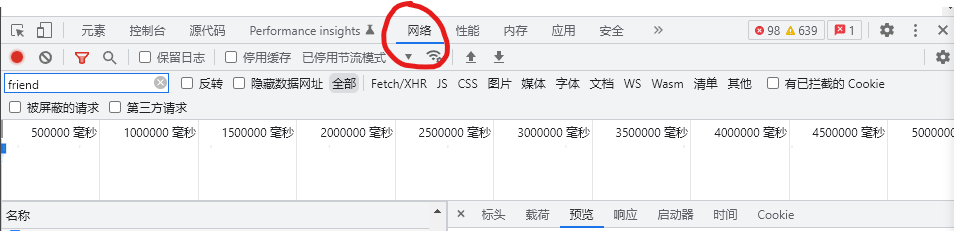

# qFriendBack

## 用途

备份好友列表

## 使用方法

### 1. 获取好友列表数据

1. 进入qq空间，点击'好友'

2. 打开控制台，切换到'网络'

3. 网站上点击'搜索好友'框，会有一个关于好友列表的请求，可以用'friend_show'关键字帮助筛选，如下

4. 点击预览，复制其中'data'的值，并粘贴到input.txt中

5. 运行processingInput.py，缺失的库需要自行下载，常用命令`pip install xxx`
6. 数据会处理好放在`output/output.json`中，好友头像则在`output/Pic`下

## 等待完善的功能

1. 可视化：将好友数据以类似qq好友列表的形式展示
2. 账号恢复：一键添加好友
3. 将数据储存为数据库格式（不必要）